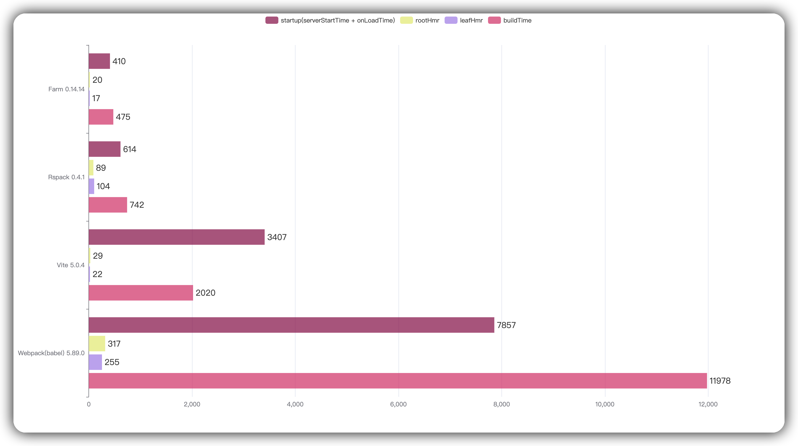

<div align="center">
  <a href="https://github.com/farm-fe/farm">
  
  </a>
  <h3>Extremely fast Vite-compatible web building tool written in Rust</h3>
  <p>
    <span>English</span> |
    <a href="https://github.com/farm-fe/farm/blob/main/README.zh-CN.md">简体中文</a>  
  </p>
  <p align="center">
    <a href="https://discord.gg/mDErq9aFnF">
      
    </a>
    <a href="https://codecov.io/gh/farm-fe/farm" > 
     
    </a>
    <a href="https://npmjs.com/package/@farmfe/core"></a>
    <a href="https://nodejs.org/en/about/releases/"></a>
  <a href="https://npmcharts.com/compare/@farmfe/core?minimal=true">
    
  </a>
  <a href="https://github.com/farm-fe/farm/blob/main/LICENSE">
    
  </a>
  </p>
  <br/>
</div>

---

## Intro

Farm is a extremely fast vite-compatible web-building tool written in Rust. Benchmark against other tools (using Turbopack's benchmark, 1000 React components) as shown below:

### All Benchmark



> Test Repository: https://github.com/farm-fe/performance-compare
>
> Test Machine (Linux Mint 21.1 Cinnamon, 11th Gen Intel© Core™ i5-11400 @ 2.60GHz × 6, 15.5 GiB)

<br />

### Hot (Startup and Build) Benchmark

> [!NOTE]
> Since Farm v0.14, Farm has implemented persistent cache. The following compares Farm's use of persistent cache in hot starts and production builds with other tools.

.jpg>)

## Online experience

[](https://codesandbox.io/p/github/ErKeLost/react/main)

<br />

## Why Farm?

> See [Why Farm](https://farm-fe.github.io/docs/why-farm) for details.

In short, tools like webpack are too slow, but new tools like Vite are not perfect, Vite has a lot of drawbacks when comes to a large project:

- **A huge number of requests during development**：when there are hundreds or thousands modules per page, loading performance severely degraded, it may takes seconds or more when refresh the page.
- **Inconsistency between development and production**: Using different strategy and tools in development and production, it's really inconsistent and it's hard to debug online issues.
- **Inflexible Code Splitting**: It's hard to control the output of your bundles.

Farm can solve these problems perfectly, and it's really fast cause it's written in Rust. Farm aims to be fast, consistent, flexible, which is the real next generation build tool.

## Features

> [!NOTE]
> Since Farm v0.13, Vite plugins can be used directly in Farm. Refer to [Using vite plugins in Farm](https://farm-fe.github.io/docs/using-plugins#using-vite-plugins-in-farm)

- ⚡ **Extremely Fast**: Written in Rust, start a React / Vue project in milliseconds and perform an HMR update within 20ms for most situations.
- ⚡ **Incremental Building**: Support persistent cache, module level cache enabled by default, any module won't be compiled twice until it's changed!
- 🧰 **Fully Pluggable and Vite Compatible**: Everything inside Farm is powered by plugins, Support Vite Plugins out of box. Supports Farm compilation plugins(both Rust and JavaScript plugins, and SWC plugins), Farm runtime plugins and Farm server plugin.
- ⚙️ **Powerful**: Compiles JS/TS/JSX/TSX, CSS, Css Modules, HTML, and static assets out of the box. Support official compilation plugins for Popular frameworks/tools like React, Vue, SolidJs, Sass, Less, Postcss and so on.
- ⏱️ **Lazy Compilation**: Dynamically imported resources are compiled only when requested, speed up compilation for large scale project. Just write a `dynamic import` and the imported module won't be compiled when it is executed.
- 📦 **Partial Bundling**: Bundle your project into a few reasonable bundles automatically, speeding up resource loading without losing caching granularity. Refer to [RFC-003 Partial Bundling](https://github.com/farm-fe/rfcs/blob/main/rfcs/003-partial-bundling/rfc.md) for details.
- 🔒 **Consistency**: What you see in development will be the same as what you get in production.
- 🌳 **Compatibility**: Supports both legacy (ES5) and modern browsers.

<br/>

> Farm has implemented all features of a web build tool, including production optimization like tree shake and minification. We have already migrated enterprise projects to Farm, and it works great!

See [RFC-001 Architecture](https://github.com/farm-fe/rfcs/blob/main/rfcs/001-core-architecture/rfc.md#motivation) for design motivation and architecture.

<br/>

## Getting Started

Create a new Farm(support both React and Vue) project with your favorite package manager:

```bash
# with npm
npm create farm@latest
# with yarn
yarn create farm@latest
# with pnpm
pnpm create farm@latest
```

Then start the project:

```bash
cd farm-project && npm start
```

See our 1 minute quick start video:

https://github.com/farm-fe/farm/assets/8372439/51e8834b-584a-4d9f-ae6f-516da70d3173

Refer to the [Documentation](https://farm-fe.github.io) to learn more about Farm.

- **[Farm Guide](https://farm-fe.github.io/docs/quick-start)**
- **[Farm Config](https://farm-fe.github.io/docs/config/farm-config)**
- **[Farm Plugins](https://farm-fe.github.io/docs/plugins/overview)**

## Farm Plugins

See [Using Plugins](https://farm-fe.github.io/docs/using-plugins) for how to use plugins in Farm.

### Rust Plugins

- **[`@farmfe/plugin-react`](https://farm-fe.github.io/docs/plugins/official-plugins/react)**
- **[`@farmfe/plugin-sass`](https://farm-fe.github.io/docs/plugins/official-plugins/sass)**

### Js Plugins

- **[`@farmfe/js-plugin-postcss`](https://farm-fe.github.io/docs/plugins/official-plugins/js-postcss)**
- **[`@farmfe/js-plugin-less`](https://farm-fe.github.io/docs/plugins/official-plugins/js-less)**
- **[`@farmfe/js-plugin-svgr`](https://farm-fe.github.io/docs/plugins/official-plugins/js-svgr)**
- **[`@farmfe/js-plugin-dts`](https://farm-fe.github.io/docs/plugins/official-plugins/js-dts)**
- **[`@farmfe/js-plugin-sass`](https://farm-fe.github.io/docs/plugins/official-plugins/js-sass)**

### Community Plugins

Plugins of Vite/Rollup/Unplugin can be directly used in Farm.

- **[`@vitejs/plugin-vue`](https://github.com/vitejs/vite-plugin-vue/blob/main/packages/plugin-vue/README.md)**
- **[`@vitejs/plugin-vue-jsx`](https://github.com/vitejs/vite-plugin-vue/tree/main/packages/plugin-vue-jsx)**
- **[`vite-plugin-solid`](https://www.npmjs.com/package/vite-plugin-solid)**
- **[`vite-plugin-mock`](https://www.npmjs.com/package/vite-plugin-solid)**
- **[unplugin-auto-import](https://github.com/antfu/unplugin-auto-import)**
- **[unplugin-vue2-script-setup](https://github.com/antfu/unplugin-vue2-script-setup)**
- **[unplugin-icons](https://github.com/antfu/unplugin-icons)**
- **[unplugin-vue-components](https://github.com/antfu/unplugin-vue-components)**
- ...

See [Community Plugins](https://farm-fe.github.io/docs/plugins/community-plugins) for more available plugins.

## Contribution

See [Contributing Guide](https://github.com/farm-fe/farm/blob/main/CONTRIBUTING.md).

## Examples

Farm support compiling React, Vue, SolidJS, Sass, Less, and Css Modules officially out of the box. See our examples:

<table>
  <thead>
    <th>React Examples</th>
    <th>Vue Examples</th>
    <th>Vite Plugin Examples</th>
  </thead>
  <tbody>
    <td>
      <ul>
        <ul>
<li><a href="https://github.com/farm-fe/farm/tree/main/examples/react">React-Basic</a></li>
<li><a href="https://github.com/farm-fe/farm/tree/main/examples/react-antd">React-Ant-Design</a></li>
<li><a href="https://github.com/farm-fe/farm/tree/main/examples/css-modules">React-Sass-CssModules</a></li>
<li><a href="https://github.com/farm-fe/farm/tree/main/examples/multi-page-app">React-Multi-Page-Application</a></li>
<li><a href="https://github.com/farm-fe/farm/tree/main/examples/react-ssr">React-SSR</a></li>
<li><a href="https://github.com/farm-fe/farm/tree/main/examples/tailwind">React-TailwindCSS</a></li>
      </ul>
    </td>
    <td>
      <ul>
<li><a href="https://github.com/farm-fe/farm/tree/main/examples/vue">Vue-Basic</a></li>
<li><a href="https://github.com/farm-fe/farm/tree/main/examples/vue-jsx">Vue-Jsx</a></li>
<li><a href="https://github.com/farm-fe/farm/tree/main/examples/vue-antdv">Vue-Antdv</a></li>
</ul>
    </td>
    <td>
    <ul>
<li><a href="https://github.com/farm-fe/farm/tree/main/examples/vite-adapter-vue">Plugin-Vue</a></li>
<li><a href="https://github.com/farm-fe/farm/tree/main/examples/solid">Plugin-Solid</a></li>
<li><a href="https://github.com/farm-fe/farm-soybean-admin">farm-soybean-admin</a>：A real admin project migrated from Vite to Farm</li>
</ul>
    </td>
  </tbody>
</table>

## Chat With Us

- [Author Twitter](https://twitter.com/brightwwu46799), [Official Twitter](https://twitter.com/fe_farm)

- With [Discord](https://discord.gg/mDErq9aFnF)

- Wechat group

<br>

## Contributors

<a href="https://github.com/farm-fe/farm/graphs/contributors">
  
</a>

## Credits

Thanks to:

- The [SWC](https://github.com/swc-project/swc) project created by [@kdy1](https://github.com/kdy1), which powers Farm's code parsing, transformation and minification.

- The [NAPI-RS](https://github.com/napi-rs/napi-rs) project created by [@Brooooooklyn](https://github.com/Brooooooklyn), which powers Farm's node-binding implementation.

- The [Rollup](https://github.com/rollup/rollup) project created by [@lukastaegert](https://github.com/lukastaegert), which inspired Farm's plugin system implementation.

- The [Vite](https://github.com/vitejs/vite) project created by [Evan You](https://github.com/yyx990803), which inspired Farm's compatibility design of ecosystem.

## 🌟 Star History

[](https://star-history.com/#farm-fe/farm&Date)

## Author

[brightwu（吴明亮）](https://github.com/wre232114), worked at Bytedance.
