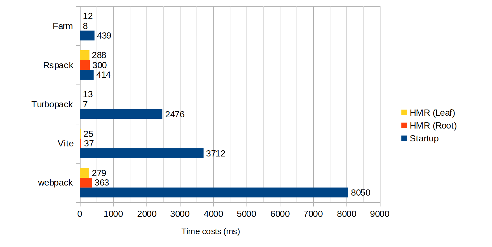

<div align="center">
  <a href="https://github.com/farm-fe/farm">
  
  </a>
  <h1>Farm</h1>
  <p>Super fast web building tool written in Rust</p>
  <p>
    <span>English</span> |
    <a href="https://github.com/farm-fe/farm/README.zh-CN.md">简体中文</a>  
  </p>
  <p align="center">
    <a href="https://npmjs.com/package/@farmfe/core"></a>
    <a href="https://nodejs.org/en/about/releases/"></a>
    <a href="https://github.com/farm-fe/farm/actions/workflows/rust-test.yaml"></a>
  </p>
  <br/>
</div>

---

## Intro

Farm is a super-fast, lightweight web building tool written in Rust. Benchmark against other tools (using Turbopack's benchmark, 1000 React components) as shown below:



> Test Repository: https://github.com/farm-fe/performance-compare
>
> Test Machine (Linux Mint 21.1 Cinnamon, 11th Gen Intel© Core™ i5-11400 @ 2.60GHz × 6, 15.5 GiB)

<br />

## Features

- ⚡ **Super Fast**: Written in Rust, start a React / Vue (incoming) project in milliseconds, perform an HMR update within 10ms for most situations.
- 🧰 **Fully Pluggable**: Everything inside Farm is powered by plugins, achieve anything you want by creating a plugin. Supports both Rust and JavaScript plugins.
- ⚙️ **Powerful**: Compiles JS/TS/JSX/TSX, CSS, HTML, and static assets out of the box.
- ⏱️ **Lazy Compilation**: Dynamically imported resources are compiled only when requested.
- 📦 **Partial Bundling**: Bundle your project into a few reasonable bundles, speeding up resource loading without losing caching granularity.
- 🔒 **Consistency**: What you see in development will be exactly the same as what you get in production.
- 🌳 **Compatibility**: Supports both legacy (ES5) and modern browsers.

<br/>

> **Note**:
>
> - See [RFC-001](https://github.com/farm-fe/rfcs/blob/main/rfcs/001-core-architecture/rfc.md#motivation) for design motivation and principles.
> - **This project is still under development and not production-ready. Contributions are welcome**.
>
> This project is built on the SWC Project, using SWC for HTML/CSS/JS/TSX/TS/JSX parsing, transforming, optimizing, and code generation.

<br/>

## Getting Started

Create a new Farm project

```sh
npx @farmfe/cli@latest create
```

Start the project:

```sh
cd farm-react && npm i && npm start
```

Refer to [Documentation](https://farm-fe.github.io) to learn more about Farm.

## RoadMap

See [RoadMap](https://github.com/farm-fe/farm/ROADMAP.md).


## Contribution

See [Contributing Guide](https://github.com/farm-fe/farm/CONTRIBUTING.md).

## Author

brightwu（吴明亮）, worked at Bytedance and Tencent, technology enthusiast.
