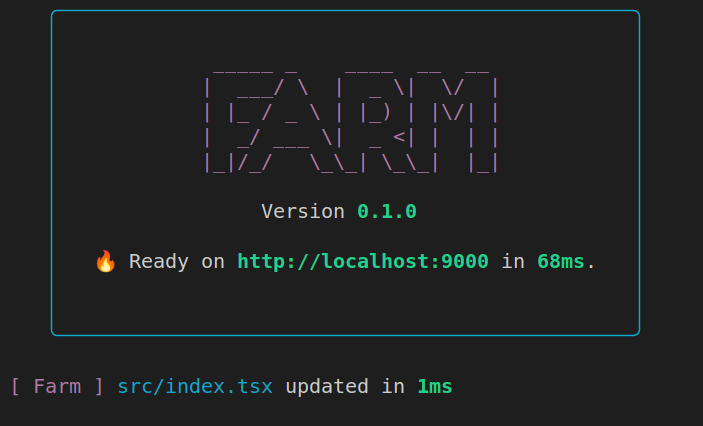

<p align="center">
  <a href="https://npmjs.com/package/@farmfe/core"></a>
  <a href="https://nodejs.org/en/about/releases/"></a>
  <a href="https://github.com/farm-fe/farm/actions/workflows/rust-test.yaml"></a>
</p>
<br/>

# Farm

> Super fast web build engine written in rust. yet another performant alternative besides webpack/vite

<br />
Started in 68ms and updated in 1ms for a demo react project as below.



**Features**:

- 🔥 **Super Fast**: Start a react / vue(incoming) project in milliseconds.
- ⚡ **"1ms" HMR**: Finish a HMR within 10ms for the most situations.
- 🧰 **Fully Pluggable**: Support both rust plugins and js plugins.
- ⚙️ **Native Web Assets Compiling Supported**: Support support compiling JS/TS/JSX/TSX, css, html natively.

<br/>

> **Note**:
>
> - See [RFC-001](https://github.com/farm-fe/rfcs/blob/main/rfcs/001-core-architecture/rfc.md#motivation) for design motivation and principle.
> - **This project is still under development. Contributions are welcome**.
>
> This project is built on SWC Project, using swc for html/css/js/tsx/ts/jsx parsing, transforming, optimizing and codegen.

<br/>

## Getting Started

Install Farm Cli:

```sh
npm install -g @farmfe/cli
```

We provided a experience react project for now. Using `farm create` to create a new project. Using `farm start` to start the project.

```sh
farm create && cd farm-react && npm i && npm start
```

## Configuring

> Official docs site is on the way...

Farm load configuration file from `farm.config.ts`. The available config as below:

```ts
export interface UserConfig {
  /** current root of this project, default to current working directory */
  root?: string;
  /** js plugin(which is a javascript object) and rust plugin(which is string refer to a .farm file or a package) */
  plugins?: (RustPlugin | JsPlugin)[];
  /** config related to compilation */
  compilation?: {
    input?: Record<string, string>;
    output?: {
      filename?: string;
      path?: string;
      publicPath?: string;
    };
    resolve?: {
      extensions?: string[];
      alias?: Record<string, string>;
      mainFields?: string[];
      conditions?: string[];
      symlinks: boolean;
    };
    external?: string[];
    mode?: 'development' | 'production';
    root?: string;
    runtime?: {
      path: string;
      plugins?: string[];
      swcHelpersPath?: string;
    };
    script?: {
      // specify target es version
      target?:
        | 'es3'
        | 'es5'
        | 'es2015'
        | 'es2016'
        | 'es2017'
        | 'es2018'
        | 'es2019'
        | 'es2020'
        | 'es2021'
        | 'es2022';
      // config swc parser
      parser?: {
        esConfig?: {
          jsx?: boolean;
          fnBind: boolean;
          // Enable decorators.
          decorators: boolean;

          // babel: `decorators.decoratorsBeforeExport`
          //
          // Effective only if `decorator` is true.
          decoratorsBeforeExport: boolean;
          exportDefaultFrom: boolean;
          // Stage 3.
          importAssertions: boolean;
          privateInObject: boolean;
          allowSuperOutsideMethod: boolean;
          allowReturnOutsideFunction: boolean;
        };
        tsConfig?: {
          tsx: boolean;
          decorators: boolean;
          /// `.d.ts`
          dts: boolean;
          noEarlyErrors: boolean;
        };
      };
    };
    partialBundling?: {
      moduleBuckets?: {
        name: string;
        test: string[];
      }[];
    };
    lazyCompilation?: boolean;
  };
  /** config related to dev server */
  server?: UserServerConfig;
}

export type RustPlugin =
  | string
  | [
      string,
      // eslint-disable-next-line @typescript-eslint/no-explicit-any
      Record<string, any>
    ];

export interface JsPlugin {
  resolve: JsPluginHook<
    {
      importers: string[];
      specifiers: string[];
    },
    PluginResolveHookParam,
    PluginResolveHookResult
  >;

  // load: JsPluginHook<{ filters: { ids: string[] }}>;
}
```
