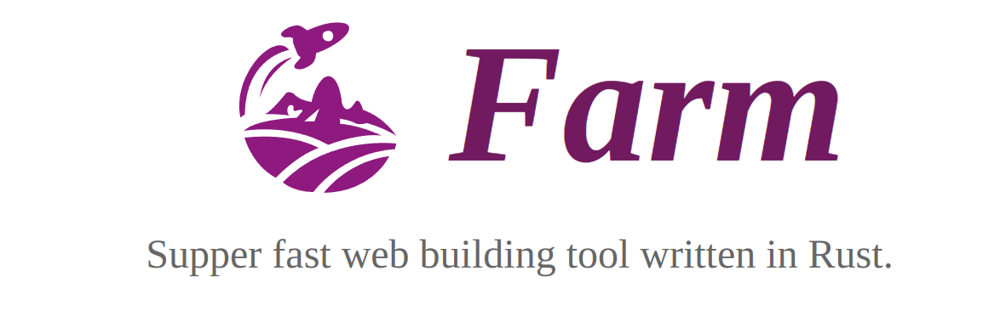

<p align="center">
  
</p>

<p align="center">
  <a href="https://npmjs.com/package/@farmfe/core"></a>
  <a href="https://nodejs.org/en/about/releases/"></a>
  <a href="https://github.com/farm-fe/farm/actions/workflows/rust-test.yaml"></a>
</p>
<br/>

Farm is a super-fast, lightweight web building tool written in Rust. Benchmark against other tools (using Turbopack's benchmark, 1000 React components) as shown below:


> Test Repository: https://github.com/farm-fe/performance-compare
>
> Test Machine (Linux Mint 21.1 Cinnamon, 11th Gen Intel© Core™ i5-11400 @ 2.60GHz × 6, 15.5 GiB)

<br />

## Features

- ⚡ **Super Fast**: Written in Rust, start a React / Vue (incoming) project in milliseconds, perform an HMR update within 10ms for most situations.
- 🧰 **Fully Pluggable**: Everything inside Farm is powered by plugins, achieve anything you want by creating a plugin. Supports both Rust and JavaScript plugins.
- ⚙️ **Powerful**: Compiles JS/TS/JSX/TSX, CSS, HTML, and static assets out of the box.
- ⏱️ **Lazy Compilation**: Dynamically imported resources are compiled only when requested.
- 📦 **Partial Bundling**: Bundle your project into a few reasonable bundles, speeding up resource loading without losing caching granularity.
- 🔒 **Consistency**: What you see in development will be exactly the same as what you get in production.
- 🌳 **Compatibility**: Supports both legacy (ES5) and modern browsers.

<br/>

> **Note**:
>
> - See [RFC-001](https://github.com/farm-fe/rfcs/blob/main/rfcs/001-core-architecture/rfc.md#motivation) for design motivation and principles.
> - **This project is still under development and not production-ready. Contributions are welcome**.
>
> This project is built on the SWC Project, using SWC for HTML/CSS/JS/TSX/TS/JSX parsing, transforming, optimizing, and code generation.

<br/>

## Getting Started

Create a new Farm project

```sh
npx @farmfe/cli@latest create
```

Start the project:

```sh
cd farm-react && npm i && npm start
```

Refer to [Documentation](https://farm-fe.github.io) to learn more about Farm.

## RoadMap

Farm has implemented all basic features for a web building tool. However, there is still work to be done to make Farm production-ready.

- [x] Resolving, loading, transforming, and resource generating for web assets (HTML, CSS, JS/JSX/TS/TSX, static assets, and so on).
- [x] Lazy Compilation
- [x] Dev Server and HMR (support React Fast Refresh)
- [x] Partial Bundling
- [x] Both Rust and JavaScript Plugin System
- [x] Source Map
- [ ] Resource Minimization
- [ ] Tree Shaking
- [ ] CSS Modules
- [ ] Official Plugins like Sass
- [ ] Persistent Cache

See milestones: https://github.com/farm-fe/farm/milestones

We look forward to more contributions. Our goal is to provide a high-quality and performant web build tool for the community.

## Contribution

Farm is divided into two parts: the `JavaScript side` and the `Rust side`:

- **the JavaScript side**: see code in the `packages` directory, contains core (dev server, file watcher, and compiler wrapper), CLI, runtime, and runtime plugins (module system, HMR).
- **the Rust side**: see code in the `crates` directory, contains core (compilation context, plugin drivers, etc.), compiler (compile process, HMR update, etc.), and plugins.

Steps to develop Farm:

1. Install Rust Toolchain (If you are new to Rust, search for "Rustup Book") and Node.js 16 or above.
2. Install dependencies with `pnpm i`.
3. Build the compiler binary: `cd packages/core && npm run build:rs`
4. Build packages (open a new terminal): `cd packages/cli && npm start`
5. Build plugin-react (open a new terminal): `cd rust-plugins/react && npm run dev`
6. Work with examples (open a new terminal): `cd examples/react && npm start`, report an issue if the example does not start normally.
7. If you changed Rust code in `crates`, run `npm run build:rs` under `packages/core` again to get the latest binary.

## Author

brightwu（吴明亮）, worked at Bytedance and Tencent, technology enthusiast.
