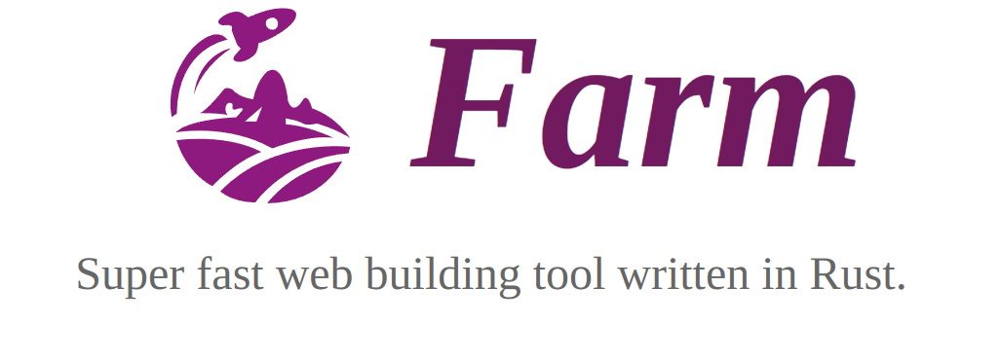

<p align="center">
  
</p>

<p align="center">
  <a href="https://npmjs.com/package/@farmfe/core"></a>
  <a href="https://nodejs.org/en/about/releases/"></a>
  <a href="https://github.com/farm-fe/farm/actions/workflows/rust-test.yaml"></a>
</p>
<br/>

Farm is a super fast, light-weight web building tool written in Rust. Benchmark against other tools(Using Turbopack's benchmark, 1000 React components) as below:


> Test Repo：https://github.com/farm-fe/performance-compare
>
> Test Machine（Linux Mint 21.1 Cinnamon， 11th Gen Intel© Core™ i5-11400 @ 2.60GHz × 6， 15.5 GiB）

<br />

## Features

- ⚡ **Super Fast**: Written in Rust, start a react / vue(incoming) project in milliseconds, perform a HMR update within 10ms for situations.
- 🧰 **Fully Pluggable**: Everything inside Farm is powered by plugins, achieve anything you want by creating a plugin. Support both Rust and Js plugins.
- ⚙️ **Powerful**: Compiling JS/TS/JSX/TSX, css, html and static assets out of box.
- ⏱️ **Lazy Compilation**: Dynamic imported resources are compiled only when they are requested.
- 📦 **Partial Bundling**: Bundle your project into a few reasonable bundles, speed up the resources loading without losing the caching granularity.
- 🔒 **Consistency**: What you see in development will be exactly the same as what you get in production.
- 🌳 **Compatibility**: Support both legacy(es5) and modern browsers.

<br/>

> **Note**:
>
> - See [RFC-001](https://github.com/farm-fe/rfcs/blob/main/rfcs/001-core-architecture/rfc.md#motivation) for design motivation and principle.
> - **This project is still under development and not production ready. Contributions are welcome**.
>
> This project is built on the SWC Project, using swc for html/css/js/tsx/ts/jsx parsing, transforming, optimizing and codegen.

<br/>

## Getting Started

Create a new Farm project

```sh
npx @farmfe/cli@latest create
```

Start the project:

```sh
cd farm-react && npm i && npm start
```

Refer to [Documentation](https://farm-fe.github.io) to learn more about Farm.

## RoadMap

Farm has implemented all basic features for a web building tool. But we still have many works to mark Farm production ready.

- [x] Resolving, loading, transforming and resource generating for web assets(html, css, js/jsx/ts/tsx, static asset and so on).
- [x] Lazy Compilation
- [x] Dev Server and HMR(support react fast fresh)
- [x] Partial Bundling
- [x] Both Rust and Js Plugin System
- [x] Source Map
- [ ] Resources Minimize
- [ ] Tree Shake
- [ ] Css modules
- [ ] Official Plugins Like Sass
- [ ] Persistent Cache

See milestones: https://github.com/farm-fe/farm/milestones

Looking forward to more contributions. Our goal is to provide a high quality and performant web build tool for the community.

## Contribution

Farm is divided into two parts: the `js side` and the `rust side`:

- **the js side**: see code in `packages` dir, contains core(dev server, file watcher and compiler wrapper), cli， runtime and runtime plugins(module system, hmr)
- **the rust side**: see code in `crates` dir, contains core(compilation context, plugin drivers...), compiler(compile process, HMR update...) and plugins.

Steps to develop Farm:

1. Install Rust Toolchain(If you are new to Rust, search `Rustup Book`) and node 16 or above.
2. Install dependencies with `pnpm i`.
3. Build the compiler binary: `cd packages/core && npm run build:rs`
4. Build packages(open a new terminal): `cd packages/cli && npm start`
5. Work with examples(open a new terminal): `cd examples/react && npm start`, report an issue if the example do not start normally.
6. If you changed Rust code, run `npm run build:rs` under `packages/core` again to get the newest binary.

## Author

brightwu（吴明亮）, worked at Bytedance and Tencent, technology enthusiast.
