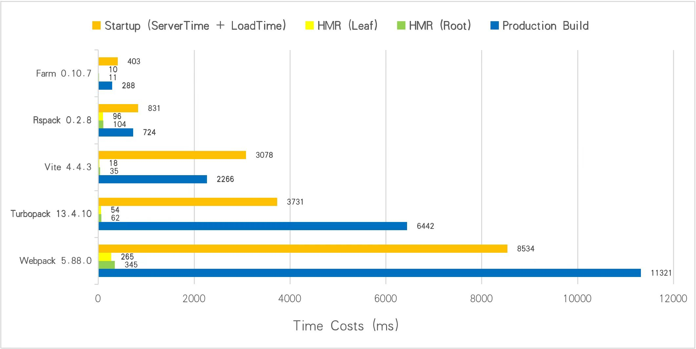

<div align="center">
  <a href="https://github.com/farm-fe/farm">
  
  </a>
  <h3>Super fast web building tool written in Rust</h3>
  <p>
    <span>English</span> |
    <a href="https://github.com/farm-fe/farm/blob/main/README.zh-CN.md">简体中文</a>  
  </p>
  <p align="center">
    <a href="https://discord.gg/mDErq9aFnF">
      
    </a>
    <a href="https://npmjs.com/package/@farmfe/core"></a>
    <a href="https://nodejs.org/en/about/releases/"></a>
  <a href="https://npmcharts.com/compare/@farmfe/core?minimal=true">
    
  </a>
  <a href="https://github.com/farm-fe/farm/blob/main/LICENSE">
    
  </a>
  </p>
  <br/>
</div>

---

## Intro
The Farm is a super-fast web-building tool written in Rust. Benchmark against other tools (using Turbopack's benchmark, 1000 React components) as shown below:



> Test Repository: https://github.com/farm-fe/performance-compare
>
> Test Machine (Linux Mint 21.1 Cinnamon, 11th Gen Intel© Core™ i5-11400 @ 2.60GHz × 6, 15.5 GiB)

<br />

## Features

- ⚡ **Super Fast**: Written in Rust, start a React / Vue project in milliseconds and perform an HMR update within 10ms for most situations.
- 🧰 **Fully Pluggable**: Everything inside Farm is powered by plugins, achieve anything you want by creating a plugin. Supports both Rust and JavaScript plugins.
- ⚙️ **Powerful**: Compiles JS/TS/JSX/TSX, CSS, HTML, and static assets out of the box.
- ⏱️ **Lazy Compilation**: Dynamically imported resources are compiled only when requested.
- 📦 **Partial Bundling**: Bundle your project into a few reasonable bundles, speeding up resource loading without losing caching granularity.
- 🔒 **Consistency**: What you see in development will be the same as what you get in production.
- 🌳 **Compatibility**: Supports both legacy (ES5) and modern browsers.

<br/>

See [RFC-001](https://github.com/farm-fe/rfcs/blob/main/rfcs/001-core-architecture/rfc.md#motivation) for design motivation and principles.

<br/>

## Getting Started

Create a new Farm(support both React and Vue) project.

With npm:

```bash
$ npm create farm@latest
```

With yarn:

```bash
$ yarn create farm
```

With pnpm:
Refer to the [Documentation](https://farm-fe.github.io) to learn more about Farm.

## Examples

Farm support compiling React, Vue, SolidJS, Sass, Less, and Css Modules officially out of the box. See our examples:

### React Examples

- [React-Basic](https://github.com/farm-fe/farm/tree/main/examples/react)
- [React-Ant-Design](https://github.com/farm-fe/farm/tree/main/examples/react-antd)
- [React-Sass-CssModules](https://github.com/farm-fe/farm/tree/main/examples/css-modules)
- [React-Multi-Page-Application](https://github.com/farm-fe/farm/tree/main/examples/multi-page-app)
- [React-SSR](https://github.com/farm-fe/farm/tree/main/examples/react-ssr)
- [React-TailwindCSS](https://github.com/farm-fe/farm/tree/main/examples/tailwind)

### Vue Examples

- [Vue-Basic](https://github.com/farm-fe/farm/tree/main/examples/vue)
- [Vue-Jsx](https://github.com/farm-fe/farm/tree/main/examples/vue-jsx)
- [Vue-Antdv](https://github.com/farm-fe/farm/tree/main/examples/vue-antdv)

### SolidJS Examples

- [SolidJS-Basic](https://github.com/farm-fe/farm/tree/main/examples/solid)

## RoadMap
The Farm has implemented all features of a web build tool, including production optimization like tree shake and minification. We have already migrated enterprise projects to Farm, and it works great!

See [RoadMap](https://github.com/farm-fe/farm/blob/main/ROADMAP.md).

## Chat With Us

- With [Discord](https://discord.gg/mDErq9aFnF)

- Wechat group


## Contribution

See [Contributing Guide](https://github.com/farm-fe/farm/blob/main/CONTRIBUTING.md).

## Author

brightwu（吴明亮）, worked at Bytedance and Tencent.
