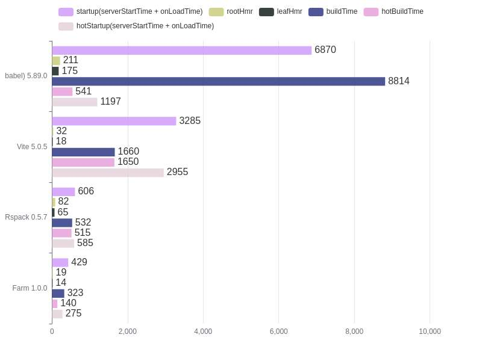

<div align="center">
  <a href="https://github.com/farm-fe/farm">
  
  </a>
  <h3>基于 Rust 的极速构建引擎</h3>
  <p>
    <a href="https://github.com/farm-fe/farm/blob/main/README.md">English</a> | 
    <span>简体中文</span>
  </p>
  <p align="center">
    <a href="https://discord.gg/mDErq9aFnF">
      
    </a>
    <a href="https://codecov.io/gh/farm-fe/farm" > 
       
    </a>
    <a href="https://npmjs.com/package/@farmfe/core"></a>
    <a href="https://nodejs.org/en/about/releases/"></a>
  <a href="https://npmcharts.com/compare/@farmfe/core?minimal=true">
    
  </a>
  <a href="https://github.com/farm-fe/farm/blob/main/LICENSE">
    
  </a>
  </p>
  <br/>
</div>

---

## 介绍

Farm 是一个使用 Rust 编写的极速 Web 构建工具，兼容 Vite 插件生态。Farm 设计为极速、强大、一致的构建工具，旨在提供更好的 web 开发体验，是真正意义的下一代构建工具。

## 在线体验

[](https://codesandbox.io/p/github/ErKeLost/react/main)

## 为什么选择 Farm？

> 详情请参阅[Why Farm](https://farmfe.org/docs/why-farm)。

总之，像 webpack 这样的工具太慢了，但像 Vite 这样的新工具也不完美，Vite 在大型项目上有很多缺点：

- **开发过程中请求量巨大**：当每个页面有成百上千个模块时，加载性能严重下降，刷新页面可能需要几秒或更长时间。
- **开发和生产不一致**：开发和生产使用不同的策略和工具，设计和实现上非常不一致，且难以调试线上问题。
- **不灵活的代码分割**：很难细粒度地控制产物的生成。

Farm 可以完美解决这些问题，而且速度非常快。 Farm 的目标是提供一个快速、一致、灵活的构建工具，这是真正的下一代构建工具。

## 特性

> - 从 0.13 版本起，Vite 插件可以直接在 Farm 中使用。参考 [使用插件](https://farmfe.org/zh/docs/using-plugins)
> - 从 0.14 版本起，Farm 支持持久缓存。参考 [增量构建](https://farmfe.org/zh/docs/advanced/persistent-cache)
> - Farm 当前已经发布 1.0 稳定版本，可在生产环境使用，查看 [官网](https://farmfe.org/zh) 开始使用 Farm

- ⚡ **超级快**: 使用 Rust 编写, 可以在毫秒级别内启动一个 React 或 Vue 项目。 在大多数情况下, 可以在 10ms 内执行 HMR 的更新。
- ⚡ **增量构建**: 支持持久缓存，以模块粒度进行缓存复用，任何一个模块如果没有改变，始终只会编译一次！
- 🧰 **完全可插拔**: Farm 由插件驱动, 兼容 Vite 插件，同时支持 Farm 编译插件（Rust 和 JavaScript 插件，以及 Swc 插件），Farm Runtime 插件，Farm Dev Server 插件。
- ⚙️ **丰富的编译能力支持**: 开箱即用, Farm 内置了 JS/TS/JSX/TSX、CSS、Css Modules、Sass、Less、Postcss，HTML 和静态资源的编译，为 React，Vue，Solid 等框架提供了官方插件。
- ⏱️ **懒编译**: 仅仅在请求时才编译动态导入的资源，极大提速大型项目的编译。通过 `dynamic import` 即可启用，被 `dynamic import` 的模块及其依赖仅在使用时才会编译。
- 📦 **局部打包**: 自动根据依赖关系、资源大小，将项目打包成若干个资源，提升资源加载性能的同时，保证缓存命中率。参考 [RFC-003 Partial Bundling](https://github.com/farm-fe/rfcs/blob/main/rfcs/003-partial-bundling/rfc.md)
- 🔒 **一致性**: 开发环境和生产环境的表现一致，所见即所得。
- 🌳 **兼容性**: 同时支持传统(ES5)和现代浏览器。

> 目前 Farm 已经实现了构建引擎的所有能力，包括生产环境优化如 Tree Shake、压缩、Polyfill 等，并且 Farm 已经发布了 1.0 版本。已有企业级项目迁移到 Farm，并且效果非常好！

<br/>

Farm 设计动机和理念请看 [RFC-001](https://github.com/farm-fe/rfcs/blob/main/rfcs/001-core-architecture/rfc.md#motivation)。

<br/>

## 快速开始

使用任意常用包管理器，即可快速创建一个 Farm 项目:

```bash
# npm
npm create farm@latest
# yarn
yarn create farm@latest
# pnpm
pnpm create farm@latest
```

查看 [Farm 文档](https://farmfe.org) 了解更多用法。

## 基准测试

Farm 远快于业界常用的 JS 构建工具，在 benchmark 测试中，Farm 比 Webpack 快 **20 倍**，比 Vite 快 **10 倍**：



详情查看 [Benchmark](https://github.com/farm-fe/performance-compare).

## 贡献

查看 [贡献指南](https://github.com/farm-fe/farm/blob/main/CONTRIBUTING.zh-CN.md)

## 交流群

- [作者推特](https://twitter.com/brightwwu46799), [官方推特](https://twitter.com/fe_farm)

- 加入 [Discord](https://discord.gg/mDErq9aFnF)

- 微信交流群

<br>

- QQ 群

<br>

## 感谢贡献者们做出的努力

<a href="https://github.com/farm-fe/farm/graphs/contributors" target="_blank">
  <table>
    <tr>
      <th colspan="2">
        <br/>
        <br/><br/>
      </th>
    </tr>
    <tr>
      <td>
        <picture>
          <source
            media="(prefers-color-scheme: dark)"
            srcset="https://next.ossinsight.io/widgets/official/compose-org-active-contributors/thumbnail.png?activity=active&period=past_28_days&owner_id=108205785&repo_ids=507542208&image_size=2x3&color_scheme=dark"
          />
          
        </picture>
      </td>
      <td rowspan="2">
       <picture>
        <source media="(prefers-color-scheme: dark)" srcset="https://next.ossinsight.io/widgets/official/compose-org-participants-growth/thumbnail.png?activity=new&period=past_28_days&owner_id=108205785&repo_ids=507542208&image_size=4x7&color_scheme=dark">
        
      </picture>
      </td>
    </tr>
    <tr>
      <td>
        <picture>
          <source
            media="(prefers-color-scheme: dark)"
            srcset="https://next.ossinsight.io/widgets/official/compose-org-active-contributors/thumbnail.png?activity=new&period=past_28_days&owner_id=108205785&repo_ids=507542208&image_size=2x3&color_scheme=dark"
          />
          
        </picture>
      </td>
    </tr>
  </table>
</a>

## 致谢

感谢:

- [SWC](https://github.com/swc-project/swc) 项目由[@kdy1](https://github.com/kdy1)创建, 为 Farm 的代码解析、转换和压缩提供了支持。

- [NAPI-RS](https://github.com/napi-rs/napi-rs) 项目由 [@Brooooooklyn](https://github.com/Brooooooklyn)创建, 为 Farm 的 node-binding 实现提供了支持。

- [Rollup](https://github.com/rollup/rollup) 项目由 [@lukastaegert](https://github.com/lukastaegert)创建, 启发了 Farm 的插件系统的实现。

- [Vite](https://github.com/vitejs/vite) 项目由 [Evan You](https://github.com/yyx990803)创建, 针对 Vite 插件生态的兼容性设计提供了启发。

## 作者 & 维护者

作者：

- [brightwu（吴明亮）](https://github.com/wre232114)，, 曾就职于字节跳动。[推特](https://twitter.com/brightwwu46799)

维护者：

- [ErKeLost](https://github.com/ErKeLost)
- [shulandmimi](https://github.com/shulandmimi)
