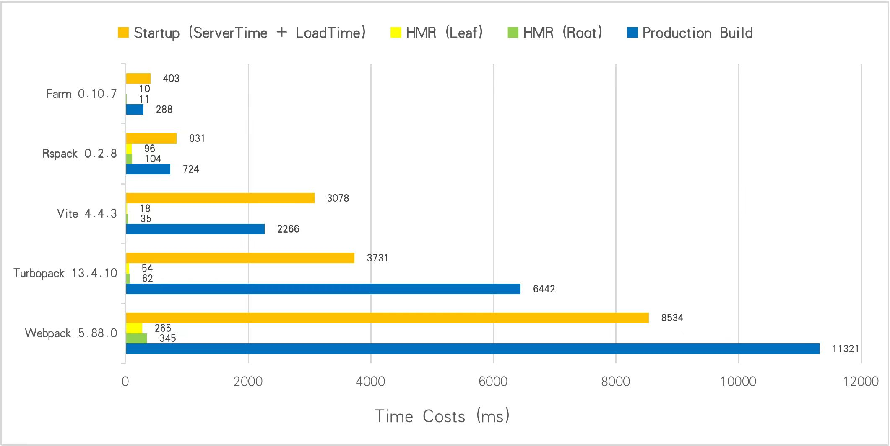

<div align="center">
  <a href="https://github.com/farm-fe/farm">
  
  </a>
  <h3>基于 Rust 的极速构建引擎</h3>
  <p>
    <a href="https://github.com/farm-fe/farm/blob/main/README.md">English</a> | 
    <span>简体中文</span>
  </p>
  <p align="center">
    <a href="https://discord.gg/mDErq9aFnF">
      
    </a>
    <a href="https://codecov.io/gh/farm-fe/farm" > 
       
    </a>
    <a href="https://npmjs.com/package/@farmfe/core"></a>
    <a href="https://nodejs.org/en/about/releases/"></a>
  <a href="https://npmcharts.com/compare/@farmfe/core?minimal=true">
    
  </a>
  <a href="https://github.com/farm-fe/farm/blob/main/LICENSE">
    
  </a>
  </p>
  <br/>
</div>

---

## 介绍

Farm 是一个使用 Rust 编写的极速 Web 构建工具，兼容 Vite 插件生态。对照其他工具进行基准性能测试 (使用 Turbopack 的基准测试，1000 个 React 组件) 如下所示:



> 测试仓库地址: https://github.com/farm-fe/performance-compare
>
> 测试机器环境 (Linux Mint 21.1 Cinnamon, 11th Gen Intel© Core™ i5-11400 @ 2.60GHz × 6, 15.5 GiB)

<br />

## 为什么选择 Farm？

> 详情请参阅[Why Farm](https://farm-fe.github.io/docs/why-farm)。

总之，像 webpack 这样的工具太慢了，但像 Vite 这样的新工具也不完美，Vite 在大型项目上有很多缺点：

- **开发过程中请求量巨大**：当每个页面有成百上千个模块时，加载性能严重下降，刷新页面可能需要几秒或更长时间。
- **开发和生产不一致**：开发和生产使用不同的策略和工具，设计和实现上非常不一致，且难以调试线上问题。
- **不灵活的代码分割**：很难细粒度地控制控制产物的生成。

Farm 可以完美解决这些问题，而且速度非常快。 Farm 的目标是提供一个快速、一致、灵活的构建工具，这是真正的下一代构建工具。

## 特性

> 从 0.13 起，Vite 插件可以直接在 Farm 中使用.

- ⚡ **超级快**: 使用 Rust 编写, 可以在毫秒级别内启动一个 React 或 Vue 项目。 在大多数情况下, 可以在 10ms 内执行 HMR 的更新。
- 🧰 **完全可插拔**: Farm 由插件驱动, 兼容 Vite 插件，同时支持 Farm 编译插件（Rust 和 JavaScript 插件，以及 Swc 插件），Farm Runtime 插件，Farm Dev Server 插件。
- ⚙️ **丰富的编译能力支持**: 开箱即用, Farm 内置了 JS/TS/JSX/TSX、CSS、Css Modules、Sass、Less、Postcss，HTML 和静态资源的编译，为 React，Vue，Solid 等框架提供了官方插件。
- ⏱️ **懒编译**: 仅仅在请求时才编译动态导入的资源，极大提速大型项目的编译。通过 `dynamic import` 即可启用，被 `dynamic import` 的模块及其依赖仅在使用时才会编译。
- 📦 **局部打包**: 自动根据依赖关系、资源大小，将项目打包成若干个资源，提升资源加载性能的同时，保证缓存命中率。参考 [RFC-003 Partial Bundling](https://github.com/farm-fe/rfcs/blob/main/rfcs/003-partial-bundling/rfc.md)
- 🔒 **一致性**: 开发环境和生产环境的表现一致，所见即所得。
- 🌳 **兼容性**: 同时支持传统(ES5)和现代浏览器。

> 目前 Farm 已经实现了构建引擎的所有能力，包括生产环境优化如 Tree Shake、压缩、Polyfill 等，已有企业级项目迁移到 Farm，并且效果非常好！

<br/>

Farm 设计动机和理念请看 [RFC-001](https://github.com/farm-fe/rfcs/blob/main/rfcs/001-core-architecture/rfc.md#motivation)。。

<br/>

## 快速开始

使用任意常用包管理器，即可快速创建一个 Farm 项目:

```bash
# npm
npm create farm@latest
# yarn
yarn create farm@latest
# pnpm
pnpm create farm@latest
```

然后启动项目:

```bash
cd farm-project && npm start
```

1 分钟快速开始视频演示:

https://github.com/farm-fe/farm/assets/8372439/51e8834b-584a-4d9f-ae6f-516da70d3173

请参考[文档](https://farm-fe.github.io) 进一步了解 Farm。

- **[Farm 教程](https://farm-fe.github.io/docs/quick-start)**
- **[Farm 配置](https://farm-fe.github.io/docs/config/farm-config)**
- **[Farm 插件](https://farm-fe.github.io/docs/plugins/overview)**

## Farm Plugins

在 Farm 中使用插件请参考文档 [Using Plugins](https://farm-fe.github.io/docs/using-plugins)

### Rust Plugins

- **[`@farmfe/plugin-react`](https://farm-fe.github.io/docs/plugins/official-plugins/react)**
- **[`@farmfe/plugin-sass`](https://farm-fe.github.io/docs/plugins/official-plugins/sass)**

### Js Plugins

- **[`@farmfe/js-plugin-postcss`](https://farm-fe.github.io/docs/plugins/official-plugins/js-postcss)**
- **[`@farmfe/js-plugin-less`](https://farm-fe.github.io/docs/plugins/official-plugins/js-less)**
- **[`@farmfe/js-plugin-svgr`](https://farm-fe.github.io/docs/plugins/official-plugins/js-svgr)**
- **[`@farmfe/js-plugin-dts`](https://farm-fe.github.io/docs/plugins/official-plugins/js-dts)**
- **[`@farmfe/js-plugin-sass`](https://farm-fe.github.io/docs/plugins/official-plugins/js-sass)**

### Community Plugins

Plugins of Vite/Rollup/Unplugin can be directly used in Farm.

- **[`@vitejs/plugin-vue`](https://github.com/vitejs/vite-plugin-vue/blob/main/packages/plugin-vue/README.md)**
- **[`@vitejs/plugin-vue-jsx`](https://github.com/vitejs/vite-plugin-vue/tree/main/packages/plugin-vue-jsx)**
- **[`vite-plugin-solid`](https://www.npmjs.com/package/vite-plugin-solid)**
- **[`vite-plugin-mock`](https://www.npmjs.com/package/vite-plugin-solid)**
- **[unplugin-auto-import](https://github.com/antfu/unplugin-auto-import)**
- **[unplugin-vue2-script-setup](https://github.com/antfu/unplugin-vue2-script-setup)**
- **[unplugin-icons](https://github.com/antfu/unplugin-icons)**
- **[unplugin-vue-components](https://github.com/antfu/unplugin-vue-components)**
- ...

更多插件请参考文档 [Community Plugins](https://farm-fe.github.io/docs/plugins/community-plugins)

## 贡献

查看 [贡献指南](https://github.com/farm-fe/farm/blob/main/CONTRIBUTING.zh-CN.md)

## 示例

Farm 支持编译 React、Vue、SolidJS、Sass、Less、Css Modules 等场景场景，具体可以查看我们的示例:

<table>
  <thead>
    <th>React Examples</th>
    <th>Vue Examples</th>
    <th>Vite Plugin Examples</th>
  </thead>
  <tbody>
    <td>
      <ul>
        <ul>
<li><a href="https://github.com/farm-fe/farm/tree/main/examples/react">React-Basic</a></li>
<li><a href="https://github.com/farm-fe/farm/tree/main/examples/react-antd">React-Ant-Design</a></li>
<li><a href="https://github.com/farm-fe/farm/tree/main/examples/css-modules">React-Sass-CssModules</a></li>
<li><a href="https://github.com/farm-fe/farm/tree/main/examples/multi-page-app">React-Multi-Page-Application</a></li>
<li><a href="https://github.com/farm-fe/farm/tree/main/examples/react-ssr">React-SSR</a></li>
<li><a href="https://github.com/farm-fe/farm/tree/main/examples/tailwind">React-TailwindCSS</a></li>
      </ul>
    </td>
    <td>
      <ul>
<li><a href="https://github.com/farm-fe/farm/tree/main/examples/vue">Vue-Basic</a></li>
<li><a href="https://github.com/farm-fe/farm/tree/main/examples/vue-jsx">Vue-Jsx</a></li>
<li><a href="https://github.com/farm-fe/farm/tree/main/examples/vue-antdv">Vue-Antdv</a></li>
</ul>
    </td>
    <td>
    <ul>
<li><a href="https://github.com/farm-fe/farm/tree/main/examples/vite-adapter-vue">Plugin-Vue</a></li>
<li><a href="https://github.com/farm-fe/farm/tree/main/examples/solid">Plugin-Solid</a></li>
<li><a href="https://github.com/farm-fe/farm-soybean-admin">farm-soybean-admin</a>：A real admin project migrated from Vite to Farm</li>
</ul>
    </td>
  </tbody>
</table>

## 交流群

- 加入 [Discord](https://discord.gg/mDErq9aFnF)

- 微信群


## 感谢贡献者们做出的努力

<a href="https://github.com/farm-fe/farm/graphs/contributors">
  
</a>

## 作者

brightwu（吴明亮）, 曾就职于字节跳动和腾讯。
