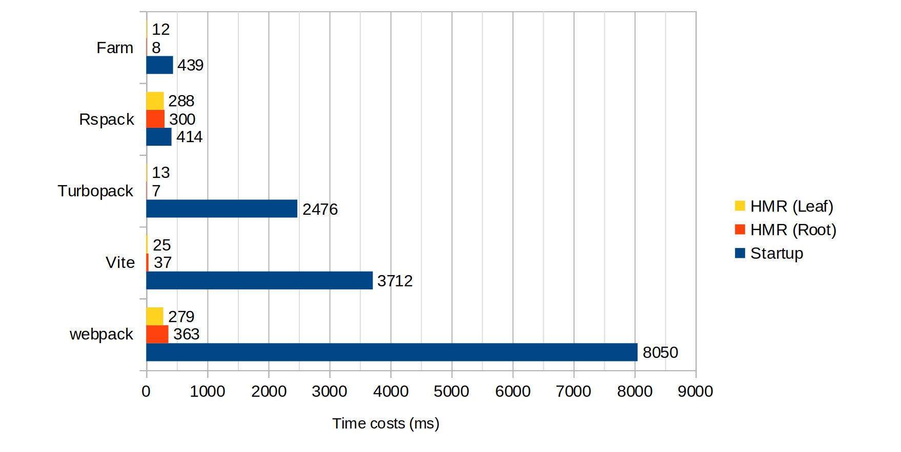

<div align="center">
  <a href="">
  
  </a>
  <h1>Farm</h1>
  <p>用 Rust 编写超快的 Web 构建工具</p>
  <p>
    <a href="https://github.com/farm-fe/farm/blob/main/README.md">English</a> | 
    <span>简体中文</span>
  </p>
  <p align="center">
    <a href="https://npmjs.com/package/@farmfe/core"></a>
    <a href="https://nodejs.org/en/about/releases/"></a>
    <a href="https://github.com/farm-fe/farm/actions/workflows/rust-test.yaml"></a>
  </p>
  <br/>
</div>

---

## 介绍

Farm 是一个使用 Rust 编写的超级快、轻量级的 Web 构建工具, 对照其他工具进行基准测试 (使用 Turbopack 的基准测试，1000 个 React 组件) 如下所示:



> 测试仓库地址: https://github.com/farm-fe/performance-compare
>
> 测试机器环境 (Linux Mint 21.1 Cinnamon, 11th Gen Intel© Core™ i5-11400 @ 2.60GHz × 6, 15.5 GiB)

<br />

## 特性

- ⚡ **超级快**: 使用 Rust 编写, 可以在毫秒级别内启动一个 React 或 Vue 项目。 在大多数情况下, 可以在 10ms 内执行 HMR 的更新。

- 🧰 **完全可插拔**: Farm 由插件驱动, 通过创建插件来实现任何您想要的, 同时支持Rust和JavaScript插件。

- ⚙️ **强大**: 开箱即用, 内置 JS/TS/JSX/TSX、CSS、HTML 和静态资源的编译。
- ⏱️ **惰性编译**: 仅仅在请求时才编译动态导入的资源。
- 📦 **智能构建**: 自动根据依赖关系 资源大小，将整个项目打包成若干个小文件，通过 bundle 提升资源加载性能，同时自动bundle的时候会考虑缓存，关系相近的文件打包到一起。
- 🔒 **一致性**: 在开发中您所看到的内容将和在生产环境中完全相同。
- 🌳 **兼容性**: 同时支持传统(ES5)和现代浏览器。

<br/>

> **注意**:
>
> - 关于设计动机和原则请看 [RFC-001](https://github.com/farm-fe/rfcs/blob/main/rfcs/001-core-architecture/rfc.md#motivation) 。
> - **项目仍在开发中，尚未准备好用于生产环境。欢迎贡献**。
>
> Farm 基于 SWC 项目构建，使用 SWC 进行 HTML/CSS/JS/TSX/TS/JSX 解析、转换、优化和代码生成。

<br/>

## 快速开始

创建一个 Farm 项目:

```sh
npx @farmfe/cli@latest create
```

启动项目:

```sh
cd farm-react && npm i && npm start
```

请参考[文档](https://farm-fe.github.io)以了解有关 Farm 的更多信息
## 开发路线图

Farm 已经实现了 Web 构建工具的所有基本功能。然而, 距离生产实际应用还有一些工作要做.

- [x] Resolving, loading, transforming, and resource generating for web assets (HTML, CSS, JS/JSX/TS/TSX, static assets, and so on).
- [x] Lazy Compilation
- [x] Dev Server and HMR (support React Fast Refresh)
- [x] Partial Bundling
- [x] Both Rust and JavaScript Plugin System
- [x] Source Map
- [ ] Resource Minimization
- [ ] Tree Shaking
- [ ] CSS Modules
- [ ] Official Plugins like Sass
- [ ] Persistent Cache

See milestones: https://github.com/farm-fe/farm/milestones

We look forward to more contributions. Our goal is to provide a high-quality and performant web build tool for the community.

## Contribution

Farm is divided into two parts: the `JavaScript side` and the `Rust side`:

- **the JavaScript side**: see code in the `packages` directory, contains core (dev server, file watcher, and compiler wrapper), CLI, runtime, and runtime plugins (module system, HMR).
- **the Rust side**: see code in the `crates` directory, contains core (compilation context, plugin drivers, etc.), compiler (compile process, HMR update, etc.), and plugins.

Steps to develop Farm:

1. Install Rust Toolchain (If you are new to Rust, search for "Rustup Book") and Node.js 16 or above.
1. 安装 Rust 开发环境
1. Install dependencies and build core packages with `pnpm bootstrap`.
1. Work with examples (open a new terminal): `cd examples/react && npm start`, report an issue if the example does not start normally.
1. 如果你修改了在 `crates` 包中的 Rust 代码, 请在 `packages/core` 包中执行 `pnpm run build:rs` 来编译最新的代码

## Author

brightwu（吴明亮）, 曾就职于字节跳动和腾讯, 技术爱好者.
